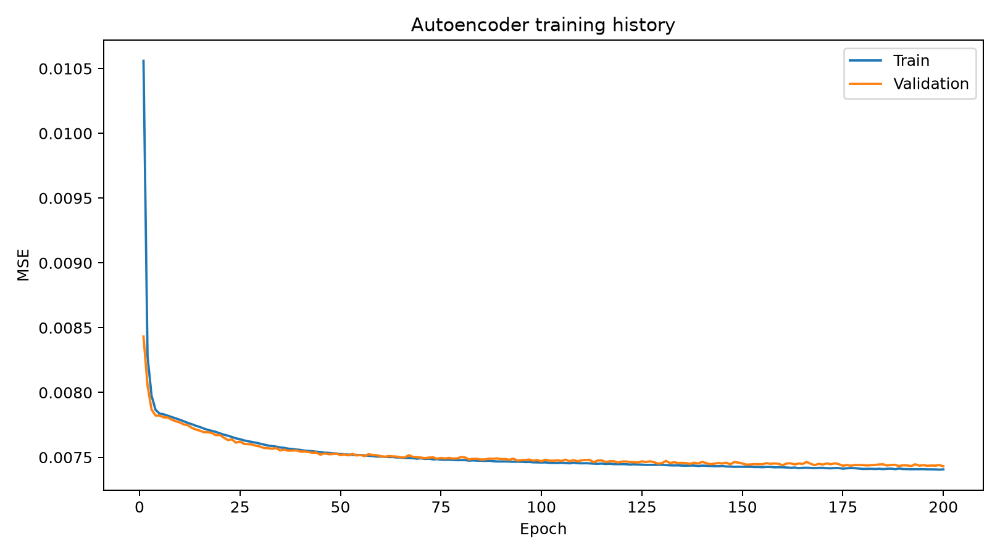
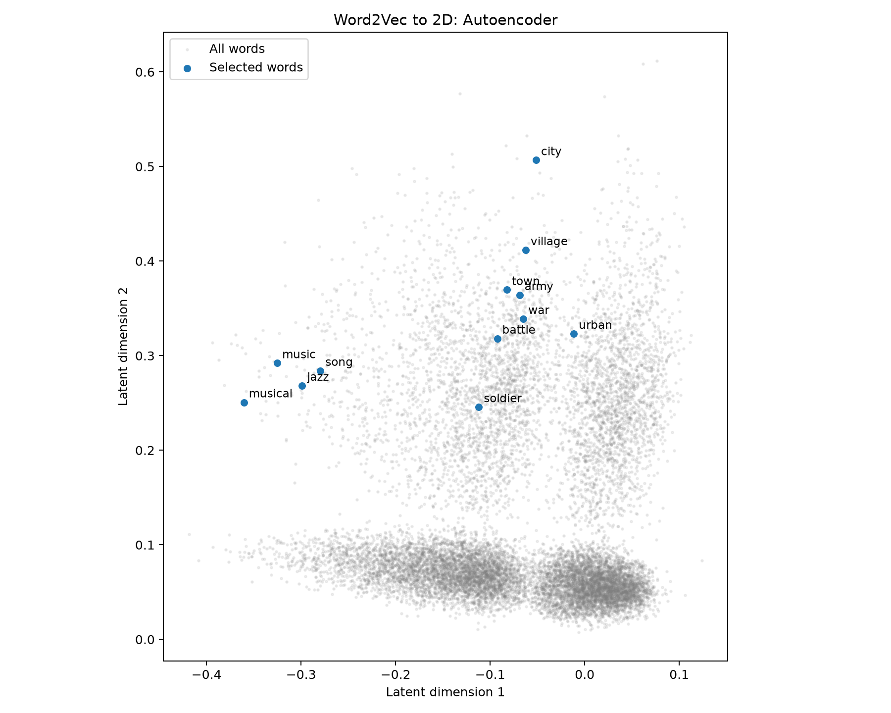

# Word2Vec → Autoencoder 二维降维完整实验报告

实验日期：2026-09-29。实验运行目录：20260929_170321_581954。

## 1. 目标与结论

本次完成固定 Word2Vec 词向量的数据准备、全连接 Autoencoder 搭建、训练、验证、
最佳参数保存、测试集推理、二维可视化及 PCA 对照。
Autoencoder 的重建误差和邻居保留率均优于本次 PCA，但两者的二维 top-10 邻居保留率均低。
二维图可用于辅助探索，不应替代原始 100 维词向量的精确相似词检索。

本报告真实实验指标来自用户提供的服务器输出截图；训练曲线与散点图来自实际下载的 PNG。
本地重构后的代码通过独立小规模测试验证，未冒充在本地重新完成这次 200 轮实验。
真实 best.pt、数据文件与完整 history.csv 尚未从服务器下载到本地仓库。

## 2. 原始 Word2Vec 模型与环境

选用已有 dual + dot、100 维模型，没有因为迁移服务器重新训练 Word2Vec。
最初考虑过 cosine 模型，最终实际实验使用 dot 模型，二者不可混写。
源文件：
`w2v_dual_dot_d100_w5_n5_bs2048_lr0.01_mc10_ss1em04_e20_vf0.1_p3_seed42.pt`。

继承的语料与配置：英文 Wikipedia 100K 句，min_count=10，
窗口半径5、5个负样本、subsampling=0.0001、batch=2048、
lr=0.01、10%验证句子、patience=3、seed=42。
checkpoint 配置中 temperature=0.1，但 dot 模式不使用 cosine 温度缩放。
100K 是句子数量，不是词表大小。

服务器截图：GPU 标识 NVIDIA GeForce RTX 4090，PyTorch 2.12.1+cu130，
CUDA available=True；nvidia-smi 显示的 CUDA 13.2 是驱动能力信息。
本地流程验证使用 PyTorch 2.9.0+cu130（CPU 执行测试），未进行性能对比。

dual 有两张表，本次提取 center_embeddings，与 inference.py 的相似词查询一致。
提取出的 E 形状为 (14951, 100)，无零向量，全部元素有限。

## 3. 样本生成与数据划分

每个词对应一条训练样本。逐行处理：
x_i = E_i / max(||E_i||_2, 1e-12)，目标 y_i = x_i。

L2 归一化让重建任务关注方向，减少向量长度对损失的影响。
它不是降维，也不保证二维距离保持余弦关系。
每行独立归一化，无需从全体样本拟合均值，因此先归一化再划分不引入跨样本统计泄漏。

使用 detach 固定 Word2Vec，不更新原来的中心词或上下文表。
不重新生成滑动窗口样本或负样本。
固定 torch.Generator(seed=42) 随机排列行号，X 和 words 保持原词表顺序。

| 子集 | 数量 | 用途 |
|---|---:|---|
| 训练 | 11,960 | 更新 Autoencoder 参数 |
| 验证 | 1,495 | 选最佳 epoch、early stopping |
| 测试 | 1,496 | 最终误差与邻居评估 |

训练样本只存一份 X，通过索引取得子集，目标在训练时直接使用 x。
词曾参与 Word2Vec 训练，不妨碍它被作为 Autoencoder 的留出词；
本次泛化结论仅针对固定词向量的压缩，不是对完全未见文本的端到端泛化。

## 4. 模型与数学目标

编码器：100 → Linear(32) → ReLU → Linear(2)。
解码器：2 → Linear(32) → ReLU → Linear(100)。
没有 Attention、Dropout、BatchNorm，也没有在二维层或输出层加 ReLU。

输出允许负数，以重建含负分量的词向量。
隐藏层激活提供非线性；纯仿射层串联可合并成一个仿射映射。

z = f_theta(x)，x_hat = g_phi(z)。
L = (1/(B*d)) Σ_i Σ_j (x_hat_ij - x_ij)^2，d=100。
参数数目：3232 + 66 + 96 + 3300 = 6694。
训练时编码器和解码器共同通过链式法则更新；推理二维坐标只使用编码器。

重建约束不直接约束二维邻近结构。例如对编码输出第一维乘10，
解码器输入先除10，重建不变，但二维距离和邻居可以变化。

## 5. 训练、验证与模型选择

| 超参数 | 值 |
|---|---|
| Optimizer | Adam |
| 学习率 | 0.001 |
| Batch size | 64 |
| 最大 epoch | 200 |
| patience | 15 |
| seed | 42 |
| 改善规则 | 验证 MSE 严格下降，min_delta=0 |

每批：清梯度 → 前向 → MSE → backward → step。
backward 计算梯度，step 更新参数；eval 不冻结参数，no_grad 关闭梯度记录。
验证不执行反向传播或参数更新。各 batch 的 loss 乘样本数后累计，
最后除总样本数，避免最后不足一批时的偏权问题。

保存验证 MSE 最低的模型；连续15轮无改善才停止。
本次最佳 epoch=200，达到轮数上限停止，没有触发 early stopping。
即使很小的改善也会清零等待计数。

| 记录 | 数值 |
|---|---:|
| 第200轮训练 MSE | 0.00740663 |
| 最佳验证 MSE | 0.00743096 |
| 最佳 epoch | 200 |
| 测试 MSE | 0.007460610941052437 |

训练 MSE 是一轮中模型逐批变化时的平均值，验证 MSE 是轮末固定模型的值；
所以早期验证误差低于训练误差并不必然异常。
后期曲线接近且趋缓，没有明显验证误差持续上升的迹象，不等于证明模型最优。

## 6. 推理与二维可视化

加载 best.pt，切换 eval，在 no_grad 下计算测试重建 MSE，
再按原词序编码全部词，得到 Z 形状 (14951, 2)。
没有对解码结果再做 L2 归一化，MSE 直接与归一化输入比较。

绘图以全部词作灰色背景，只标注12个选定词。
横纵轴是学到的潜在坐标，没有预先指定语义；equal aspect 避免显示比例扭曲距离。
music、song、jazz、musical 相对集中；地点类与战争类存在混杂。
下方密集点带未逐词分析，不能擅自命名主题或断言表示坍塌。

## 7. town 与 army 的局部诊断

| 查询 | 对方 | 100维排名 | 二维排名 | 原余弦相似度 |
|---|---|---:|---:|---:|
| town | army | 5952 | 18 | 0.0815 |
| army | town | 5857 | 28 | 0.0815 |

余弦相似度对称，但排名依赖各自其他邻居，排名不必对称。
两个词各自的 top-10 保留率均为0。

town 原始近邻包括 city、downtown、village，二维近邻包括 infantry、round、following。
army 原始近邻包括 command、forces、military、troops，二维近邻包括 county、reported、competition。
这说明这两个词在降维中发生了明显邻近关系变化。
0只表示原来10个邻居未出现在新的前10，不能解释为全部语义信息丢失。

## 8. PCA 对照方法

PCA 只在同一训练集上拟合均值 mu 和两个主方向 W（100×2）。
用中心化训练矩阵 SVD 的前两个右奇异向量作为 W。
对测试词：
z = (x - mu)W；x_hat = zW^T + mu。
再计算与 Autoencoder 完全相同定义的重建 MSE。

PCA 最大化正交线性投影保留的方差，等价于最小化该约束下平方重建误差，
不是专门优化“可视化语义邻居”。恢复100维形状不能恢复丢弃的信息。

邻居保留率：
R_k(i) = |N_k^100D(i) ∩ N_k^2D(i)| / k。
对1496个测试查询词平均；候选是全部14951个词，排除自身。
原空间按余弦相似度，二维按欧氏距离，k=10。
全词表作候选是检索评估协议，并不意味着用测试词拟合降维变换。

| 方法 | 测试 MSE | 平均 R10 | 百分比 |
|---|---:|---:|---:|
| Autoencoder | 0.007460610941052437 | 0.010227273218333721 | 1.0227% |
| PCA | 0.0077693769708275795 | 0.005815508309751749 | 0.5816% |

Autoencoder 的 MSE 比 PCA 低约3.97%，R10 高约0.44个百分点。
平均每个测试词保留原有10个邻居中的0.102个（AE）或0.058个（PCA）。
相对更优与绝对效果较差可以同时成立。

这只是一个 checkpoint、一个 seed、一个二维网络的结果，没有多次重复或统计显著性检验。
不能推广为所有 Autoencoder 必然优于 PCA。
归档 JSON 是截图指标的人工转录，不是伪造的原始服务器日志。

## 9. 基准、解释与限制

归一化100维输入的全零重建 MSE 固定为1/100=0.01。
AE测试误差相对这一简单基准低约25.39%；验证误差相对它低约25.69%。
误差减少百分比不是“语义保留百分比”，全零也不是最强常数基准。
MSE 随维度、预处理和定义改变，不能跨尺度直接比较。

增加训练轮数不保证邻居保留率提高；即使没有过拟合，重建目标与邻居目标也可能不一致。
若后续尝试邻居损失、更高潜在维度或其他可视化方法，
应使用验证集调参，并预留新的最终评估，避免根据已经查看过的测试结果反复选模型。

二维重建与检索评估衡量不同方面，准确检索继续使用原始100维向量。
测试词的结果不能证明新语料或新训练的 Word2Vec 空间可以直接使用此编码器。

## 10. 代码整理与兼容性

采用与现有 Word2Vec 一致的根目录模块命名，保留已经在服务器使用的命令。
新增 autoencoder_utils.py，集中校验划分、词表、预处理和 checkpoint。
训练、推理、PCA 对照复用加载逻辑，删除重复验证代码。
补齐 compare_autoencoder_pca.py，自动保存 comparison.json。
新 checkpoint 保存数据哈希，旧 checkpoint 无哈希时兼容并提示；迁移无需沿用原绝对路径。

清理重复 demo_train.py，保留用途不同的 demo_text_train.py 与 demo_dataloader.py。
将冗长阶段记录从 README 移入 docs/LEARNING_HISTORY.md；历史报告保留。
忽略 .idea/ 与生成数据，保留 train.py 原有形状注释。
本地对照使用直接欧氏距离计算，以减少极近点的浮点抵消；原服务器脚本使用 cdist 默认实现，
在几乎并列的距离处重新计算的邻居排名可能略有差异，报告保留原实测值。

## 11. 复现与验证

完整命令见 AUTOENCODER_README.md。
测试覆盖原 Word2Vec 功能、归一化/词序/划分、完整小样本CLI流程、
模型重载、验证不更新参数、加权MSE、PCA重建以及邻居指标与自排除。
固定seed帮助复现，但不同硬件和PyTorch版本不保证逐位一致。
best.pt不保存优化器状态，不用于精确中断续训。

本次整理后执行 `python -m unittest discover -v`：10项测试全部通过（原 Word2Vec 6项、Autoencoder 4项），其中全流程测试实际运行准备、训练、推理、PCA对照与PNG生成。
