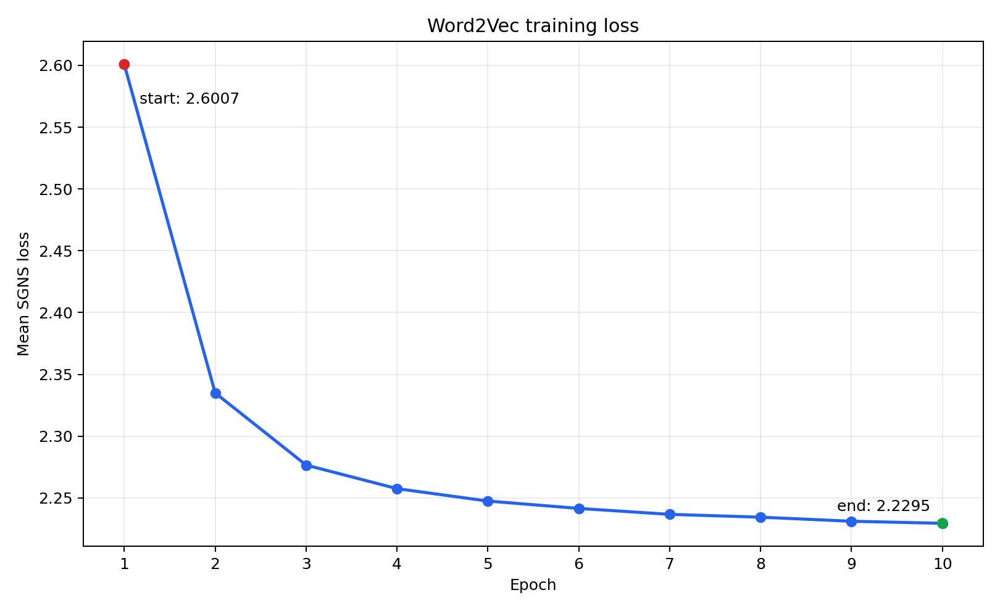
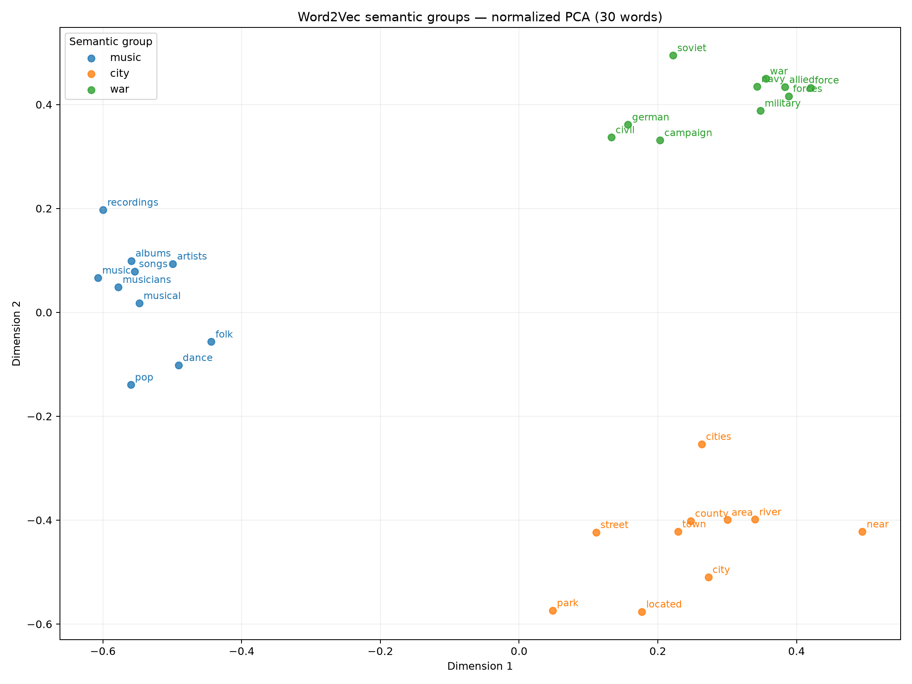
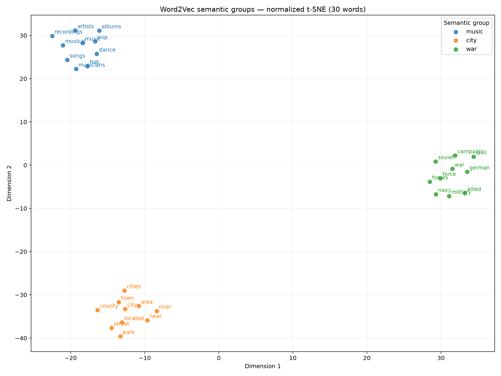

# PyTorch Word2Vec（SGNS）实验报告

## 1. 实验目标

本项目不调用现成的 Word2Vec 训练接口，而是使用 PyTorch 实现 Skip-gram with Negative Sampling（SGNS）的完整流程：英文文本清洗、词表构建、高频词降采样、正负样本生成、模型训练、checkpoint 保存与恢复、余弦相似词查询，以及 PCA 和 t-SNE 可视化。

正式实验的目标是在单张 RTX 5090 上将训练时间控制在 6 小时以内，并让模型产生可解释的相似词和语义聚类。

## 2. 数据集与预处理

正式实验使用 [Leipzig Corpora Collection](https://wortschatz.uni-leipzig.de/en/download/eng) 的 `eng_wikipedia_2016_100K` 英文 Wikipedia 句子语料。压缩包大小为 25,566,797 字节，SHA-256 为：

```text
04aa301072a612e0368f1a0abe5f6b011ab03df84961c29b80bd12683a5a6f0
```

语料统计如下：

| 项目 | 数值 |
|---|---:|
| 句子数 | 100,000 |
| 清洗后 token 数 | 2,121,562 |
| 不重复单词数 | 87,810 |
| 句长（最小 / 平均 / 最大） | 2 / 21.22 / 53 |
| `min_count=10` 后词表大小 | 14,951 |
| `min_count=10` 后保留 token | 1,962,652（92.51%） |

预处理保持每句话的边界，正样本不会跨句生成。负采样概率与词频的 0.75 次方成正比；高频词降采样使用固定随机种子42，保证数据准备可以复现。

## 3. 模型与正式训练配置

模型包含中心词向量表和上下文词向量表。每条训练样本由一个中心词、一个真实上下文词和5个负样本组成，目标函数使用 SGNS 的二元逻辑损失。

| 参数 | 正式设置 |
|---|---:|
| 词表大小 | 14,951 |
| 词向量维度 | 100 |
| 窗口半径 | 5 |
| 每个正样本的负样本数 | 5 |
| 高频词降采样阈值 | `1e-4` |
| batch size | 2,048 |
| epoch | 10 |
| 优化器 | Adam |
| 学习率 | 0.01 |
| DataLoader workers | 8 |
| 随机种子 | 42 |
| 训练设备 | NVIDIA GeForce RTX 5090 |
| PyTorch / CUDA build | 2.12.1+cu130 / 13.0 |

每轮动态生成 6,840,310 个有向正样本，约3,340个 batch。Dataset 按 worker 对句子分片，各 worker 使用独立随机状态，因此不会重复或遗漏句子。

## 4. 训练结果

正式训练总耗时 **34分49秒**，平均每轮约3分29秒，远低于6小时上限。单 worker 基线约为每轮22分10秒；8 workers 的冒烟测试约为每轮3分36秒，数据准备并行化带来了约 **6.17 倍**的单轮速度提升。

| Epoch | Mean loss |
|---:|---:|
| 1 | 2.600747 |
| 2 | 2.334961 |
| 3 | 2.276622 |
| 4 | 2.257551 |
| 5 | 2.247494 |
| 6 | 2.241542 |
| 7 | 2.236745 |
| 8 | 2.234454 |
| 9 | 2.231168 |
| 10 | 2.229495 |

从第1轮到第10轮，平均 loss 下降约 **14.27%**。前两轮下降最快，后续逐步趋稳，说明模型已经收敛到较稳定的区域。



正式 checkpoint 为 `checkpoints/word2vec_100K.pt`，大小36,185,227字节。服务器文件与本地备份的 SHA-256 完全相同：

```text
16d01fbfc55a9653820bf9b76930d56ce53dbb7e0f596a66d8505bbd49d3515b
```

checkpoint 和原始语料属于生成产物，不提交到 Git；复现实验时需要把它们放到对应的本地目录。

## 5. 相似词结果

推理阶段对中心词向量做 L2 归一化，并按余弦相似度返回 top-k。以下是正式 checkpoint 的代表性结果：

| 查询词 | 代表性近邻 |
|---|---|
| `music` | pop, dance, musical, albums, musicians, artists, songs, recordings, folk |
| `city` | town, area, located, park, county, river, street, near, cities |
| `war` | force, german, military, forces, soviet, navy, campaign, civil, allied |

这些词不一定是严格同义词。Word2Vec 学习的是上下文分布，因此主题相关、语法作用相似或经常出现在相近上下文中的词都可能靠近。

## 6. PCA 与 t-SNE 可视化

降维前先对词向量进行 L2 归一化，使输入与余弦相似词查询采用相同的方向信息。选取 `music`、`city` 和 `war` 三组词进行着色后，PCA 图显示三个主题沿整体线性方向分开。



t-SNE 图中三组形成紧凑且清晰的局部聚类。t-SNE 的坐标轴没有固定语义，组间二维距离也不能解释为原始100维空间中的精确距离比例。



## 7. 结论与局限

扩大到100K句、100维并训练10轮后，相似词和主题聚类都比10K句实验更清楚。训练曲线稳定下降，运行时间满足限制，说明当前数据规模、模型容量和工程优化能够支持一次完整且可复现的 Word2Vec 实验。

可视化词组来自模型的相似词结果，因此它证明了结果的内部一致性，但不属于独立评估。语料规模仍小于工业级 Word2Vec，罕见词、多义词和类比推理能力可能不足。后续可加入公开词相似度或类比数据集，报告 Spearman 相关系数和 analogy accuracy。

## 8. 复现主要结果

在项目目录中运行相似词查询：

```bash
python inference.py music --checkpoint checkpoints/word2vec_100K.pt --top-k 10
python inference.py city --checkpoint checkpoints/word2vec_100K.pt --top-k 10
python inference.py war --checkpoint checkpoints/word2vec_100K.pt --top-k 10
```

生成 loss 曲线：

```bash
python plot_loss.py --checkpoint checkpoints/word2vec_100K.pt --output figures/word2vec_100K_loss.png
```

生成分组 PCA 和 t-SNE 图：

```bash
python visualize.py --checkpoint checkpoints/word2vec_100K.pt --output-dir figures/word2vec_100K_grouped --perplexity 5 --group "music:music,pop,dance,musical,albums,musicians,artists,songs,recordings,folk" --group "city:city,town,area,located,park,county,river,street,near,cities" --group "war:war,force,german,military,forces,soviet,navy,campaign,civil,allied"
```

## 9. 可配置四模型对比实验

新版本将 embedding table 数量和训练打分方式拆成两个独立开关，因此形成四种组合：
`dual + dot`、`shared + dot`、`dual + cosine` 和 `shared + cosine`。其中 `dual`
使用中心词与上下文两张表，`shared` 共享一张表；cosine 模型使用 `temperature=0.1`
缩放训练 logits。

四组实验都使用100K句语料、100维向量、窗口半径5、5个负样本、batch size
2,048、学习率0.01、最多20轮，以及按完整句子划分的10%验证集。Early stopping
设置为 `patience=3`、`min_delta=0.001`。训练集与验证集共享全语料的正上下文排除表，
验证负样本固定不变，避免把训练集中的已知正上下文当成验证负样本，也避免每轮验证目标变化。

| Embedding | 训练打分 | Temperature | 最佳 epoch | 最佳验证 loss | 训练停止点 |
|---|---|---:|---:|---:|---:|
| dual | dot | 不适用 | 1 | 2.458485 | 4（early stop） |
| shared | dot | 不适用 | 6 | 3.739783 | 9（early stop） |
| dual | cosine | 0.1 | 20 | 2.250856 | 20 |
| shared | cosine | 0.1 | 20 | 3.799480 | 20 |

这些验证 loss 来自不同参数化和不同 logit 计算方式，数值尺度并不完全等价，不能只按
loss 大小给四个模型排序。它们主要用于各自训练过程中的 checkpoint 选择和 early stopping。

推理阶段统一使用中心词向量之间的余弦相似度，并对 `music`、`city`、`war` 进行
top-10 人工检查。结果概括如下：

| 模型 | 人工观察 |
|---|---|
| dual + dot | 三个查询都能返回合理结果，但近邻相对分散 |
| shared + dot | `war` 的结果较好，`music` 和 `city` 中出现较多宽泛关联词 |
| dual + cosine, T=0.1 | 三个查询的语义最集中，整体表现最好 |
| shared + cosine, T=0.1 | 整体接近 dual cosine，参数更少，但偶尔出现噪声词 |

例如，`dual + cosine, T=0.1` 为 `music` 返回 `pop、folk、songs、dance、musical、
jazz、guitar、albums、musicians、song`；为 `city` 返回 `town、county、downtown、
area、park、district、tourist、located、san、centre`；为 `war` 返回 `army、civil、
military、campaign、wars、soviet、vietnam、troops、france、allies`。

实验中还训练过未缩放的 cosine 模型（`temperature=1`）。该模型对无关词也产生接近
0.9998 的余弦相似度，说明向量方向发生坍塌。加入 `temperature=0.1` 后，相似度恢复到
有区分度的范围，近邻语义也明显改善，因此未缩放模型不计入正式四模型比较。

以上排名属于三个查询词上的定性检查，不能替代独立定量评估。后续应使用 WordSim353、
SimLex-999 或词类比数据集报告相关系数或准确率，再判断配置是否能稳定推广到其他词。

一次联合复现四模型查询的命令为：

```bash
python inference.py music --top-k 10 --similarity cosine --checkpoint \
  checkpoints/w2v_dual_dot_d100_w5_n5_bs2048_lr0.01_mc10_ss1em04_e20_vf0.1_p3_seed42.pt \
  checkpoints/w2v_shared_dot_d100_w5_n5_bs2048_lr0.01_mc10_ss1em04_e20_vf0.1_p3_seed42.pt \
  checkpoints/w2v_dual_cosine_t0.1_d100_w5_n5_bs2048_lr0.01_mc10_ss1em04_e20_vf0.1_p3_seed42.pt \
  checkpoints/w2v_shared_cosine_t0.1_d100_w5_n5_bs2048_lr0.01_mc10_ss1em04_e20_vf0.1_p3_seed42.pt
```
